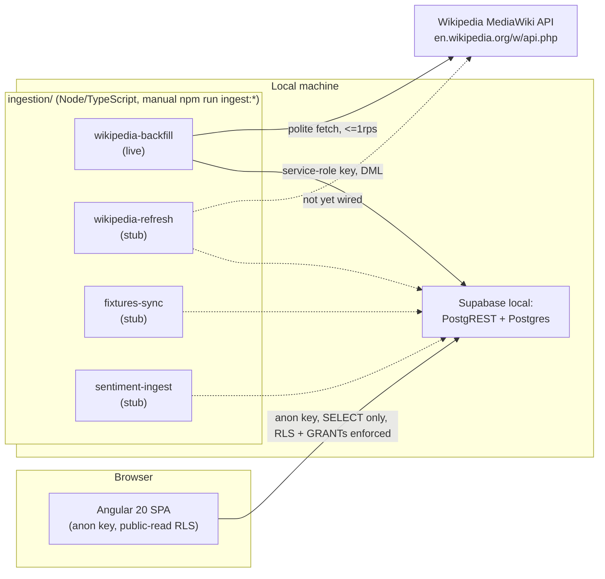
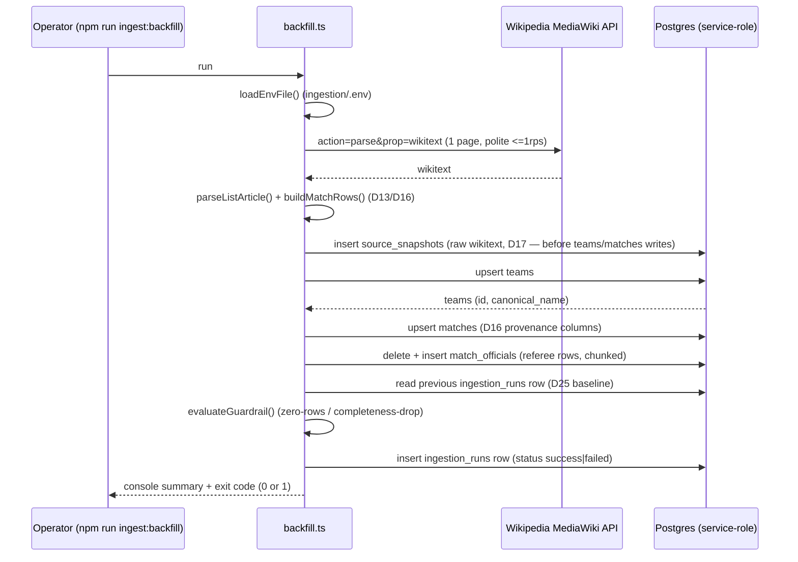
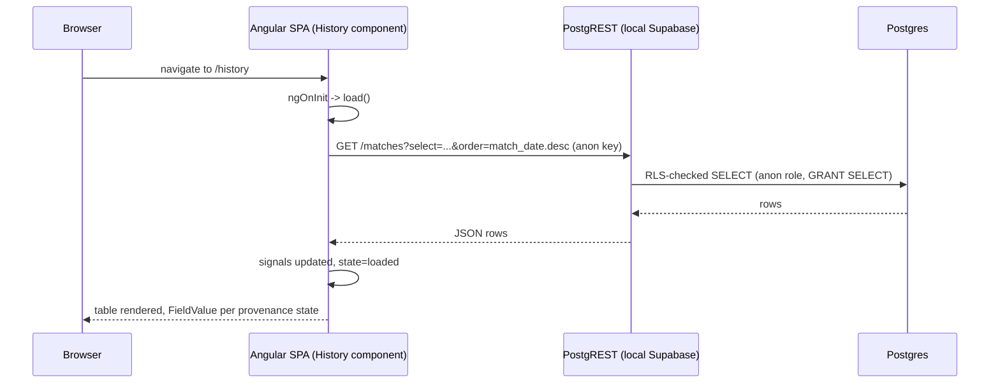

# Architecture — Springbok Tracking (as built)

> **Scope note.** This document describes `main` at commit `ac4d553`
> ("Merge Wikipedia history backfill + field map (#74)"), read on 2026-08-01
> for ticket #81. Slices #76 (lineups/events from match/season articles),
> #77, #78 and #79 are in flight on separate branches and are **not**
> reflected here. Where a thing described below is a stub rather than a
> live path, this document says so explicitly — accuracy over completeness.
> Anything asserted about "why" cites a PRD decision ID (D-number, see
> `docs/prd.md`) or an AGENTS.md rule number.

## 1. System summary

Springbok Tracking is a local-only, read-only walking skeleton (#73): an
Angular 20 single-page app reads South Africa rugby test-match data from a
local Supabase project (Postgres + PostgREST) using the public anon key,
under Postgres row-level security that permits public reads only. A
separate family of plain TypeScript ingestion scripts, run manually via
`npm run ingest:*`, populates that Postgres database by fetching from the
Wikipedia MediaWiki API (and, per stubs described in §4, will eventually
also fetch API-Sports fixtures and Reddit/Guardian sentiment sources) using
the Supabase service-role key. The browser and the ingestion scripts never
talk to each other directly and never share credentials — the app has no
path to any upstream source at all (D19), and ingestion is the only writer
to Postgres.

## 2. Frontend

### 2.1 Routes (`app/src/app/app.routes.ts`)

| Path | Component | State |
|---|---|---|
| `/` | `Home` | Live — loads next fixture, in-progress match (if any), latest result |
| `/history` | `History` | Live — loads all `matches` rows, client-side filter by opponent/competition/era |
| `/match/:id` | `MatchDetail` | **Stub** — component body is empty (`app/src/app/pages/match-detail/match-detail.ts`), no data loading wired yet |
| `/match/:id/timeline` | `MatchTimeline` | **Stub** — empty component (`match-timeline.ts`) |
| `/method` | `Method` | **Stub** — empty component (`method.ts`); the PRD §2.5 method page (D5's method-link destination) has no content yet |
| `**` | redirect to `/` | — |

`Home` and `History` are the only pages that actually query Supabase today.
Both follow the same pattern: `ngOnInit` kicks off an async `load()`,
results land in signals, and a `state` signal (`'loading' | 'loaded' |
'error'`) drives the template — a missing field, empty table, or
unreachable Supabase must degrade to a visible, honest state rather than
throw or blank the page (AGENTS.md non-negotiables, D16).

### 2.2 Shared building blocks (`app/src/app/shared/`)

- **`provenance.ts`** — the `Provenance` type: `'present' | 'absent_in_source'
  | 'not_yet_fetched' | 'fetch_failed'`, the four D16 states every nullable
  fact field carries.
- **`field-value/`** (`FieldValue` component, D16 rendering pattern) — a
  single reusable component that switches on a `provenance` input and
  renders each state distinctly: `present` shows the value; `absent_in_source`
  renders "not recorded"; `not_yet_fetched` renders a loading shimmer;
  `fetch_failed` renders an alarmed "⚠ temporarily unavailable" badge. A
  `@default` arm also renders the failed state defensively, in case the DB
  CHECK constraint (§3) is ever loosened without the frontend being
  updated. Both `Home` and `History` import this component for every
  provenance-bearing field instead of rendering raw values.
- **`match-models.ts`** — `MatchRow` (a `matches` row joined to its
  opponent `teams` row) and `FixtureRow` (a `fixtures_upstream` row, which
  carries **no** provenance columns — D14/D28: a missing venue/kickoff here
  just means the API-Sports source hasn't confirmed it yet, not a fetch
  failure). Also `opponentName()` and `decadeOf()` helpers.

### 2.3 Data access (`app/src/app/core/supabase.service.ts`)

A thin `SupabaseService` wraps `@supabase/supabase-js`, constructed once
with `environment.supabaseUrl` (`http://127.0.0.1:54321` locally) and
`environment.supabaseAnonKey`. The anon key committed in
`app/src/environments/environment.ts` is **the standard Supabase CLI local
demo key** — identical on every machine that runs `supabase start`,
published in Supabase's own docs, and not a secret in itself: it only
unlocks whatever RLS explicitly allows (§3). No other Supabase key is
referenced anywhere under `app/`.

Two invariants shape every query in `Home` and `History`:

- **D18** — all Supabase access from the browser uses only the anon key;
  no service-role key, no other credential, ever ships in the Angular
  bundle.
- **D19** — no user action (page load, filter click, navigation) ever
  triggers an upstream fetch. `Home.load()` and `History.load()` only ever
  call `.from(...)` against Postgres via PostgREST; there is no "refresh"
  affordance wired to Wikipedia/API-Sports/Reddit/Guardian anywhere in the
  app. Ingestion is a wholly separate, explicitly invoked process (§4).

## 3. Database (`supabase/migrations/`, `supabase/seed.sql`)

Two append-only migrations exist. `20260801105708_initial_schema.sql` is
the schema; `20260801113000_service_role_grants.sql` is the #80 fix
described below. Per the migration file's own convention comment,
provenance is `text` + `CHECK` rather than an enum (enums churn badly;
AGENTS.md 1.3 simplicity-first), and migrations from here on are
append-only — schema changes are new files, never edits to this one.

### 3.1 Tables

| Table | One-line purpose | Key columns |
|---|---|---|
| `teams` | Canonical team names + aliases; the cross-source join key (D13) | `id`, `canonical_name` (unique), `aliases text[]` |
| `matches` | One row per test match (D12's match set) | `match_id` (text PK, D13 identity: date+opponent+sequence), `match_date`, `opponent_team_id`, `sequence`, `competition`/`venue`/`kickoff_time`/`springboks_score`/`opponent_score` each with a `<field>_provenance` sibling (D16), `home_away`, `result`, `source_article_url` |
| `match_officials` | Referee + other named officials, display strings only (D13 — no player/official entities in v1) | `match_id` FK, `role` (`referee`/`assistant_referee`/`tmo`/`other`), `name` + `name_provenance` |
| `match_lineups` | Both starting XVs where present; each name independently provenance-tagged | `match_id` FK, `team_side`, `shirt_number`, `player_name` + `player_name_provenance` |
| `match_events` | One dataset shared by game-detail (list) and timeline (plotted view) per D7 | `match_id` FK, `sequence_no`, `event_type`, `team_side`, `description`/`minute` each with provenance |
| `fixtures_upstream` | API-Sports-derived future fixtures, licence-separated from Wikipedia-derived tables (D15) | `api_sports_fixture_id` (unique), `match_date`, `opponent_team_id`, `kickoff_time`, `venue`, `competition`, `fetched_at`. **No provenance columns** — see D14/D28. |
| `sentiment_scores` | Derived facts (D5/D23) — score/label/URL/dates only, never source content (D20) | `match_id` FK, `bucket` (`pre_match`/`first_half`/`second_half`/`post_match`/`whole_match`), `score numeric(4,3)` in [-1,1], `label` (5-value D2 vocabulary), `bucket_source_count`, `too_few`, `source` (`reddit`/`guardian`), `source_url` |
| `source_snapshots` | Raw wikitext per source page, so parses are reproducible/diffable (D17). Not displayed publicly. | `source_page`, `match_id` (nullable FK), `wikitext`, `fetched_at` |
| `ingestion_runs` | Ops guardrail row per run (D25). Not displayed publicly. | `source`, `pages_fetched`, `rows_written`, `failures`, `status` (`running`/`success`/`failed`), `notes` |

`matches` also carries a unique `(match_date, opponent_team_id, sequence)`
constraint and a `match_date desc` index (History's default sort, PRD §2
item 2). Every FK to `matches` cascades on delete except `source_snapshots`,
which sets `match_id` to null instead (a snapshot should survive even if its
parsed match row is later removed).

`supabase/seed.sql` separately seeds 3 real, documented matches (1995 and
2007 Rugby World Cup finals, 2015 semi-final) for the walking-skeleton
proof (#73) — this is independent of, and predates, the real 570-match
Wikipedia backfill described in §4; running `npm run db:reset` followed by
`npm run ingest:backfill --prefix ingestion` (from the repo root; or plain
`npm run ingest:backfill` from inside `ingestion/` — the root
`package.json` has no `ingest:backfill` script of its own, per AGENTS.md
§7) layers the real backfill's `teams`/`matches`/`match_officials` rows on
top of (and upserted over, where match_ids collide) the three seed
matches.

### 3.2 Provenance-state model (D16)

Every nullable "fact" column that can legitimately be missing carries a
companion `<field>_provenance` text column, constrained by a repeated
(not centrally reusable — Postgres has no named CHECK fragment) `CHECK
(... in ('present','absent_in_source','not_yet_fetched','fetch_failed'))`.
Default is `'not_yet_fetched'` on every provenance column, so a freshly
inserted row is honestly "not fetched yet" rather than implicitly "absent."
The frontend's `FieldValue` component (§2.2) is the single place these four
states are turned into UI.

### 3.3 RLS and grants posture

- RLS is enabled on all nine tables.
- `anon` gets an explicit `for select using (true)` policy **and** an
  explicit `GRANT SELECT` on seven display tables: `teams`, `matches`,
  `match_officials`, `match_lineups`, `match_events`, `fixtures_upstream`,
  `sentiment_scores`. The migration's own comment explains why both are
  needed: recent Supabase CLI versions stopped auto-exposing newly created
  tables to PostgREST API roles, so the RLS policy alone is not sufficient
  — the underlying SQL `GRANT` is required independently, and it's the
  grant, not the policy, that even lets a role attempt the query; RLS is
  what then restricts which rows come back.
- `source_snapshots` and `ingestion_runs` get **no** policy and **no**
  grant to `anon` at all — RLS's default-deny leaves both internal tables
  completely unreadable (and unwritable) to the public role. This is the
  "internal tables default-deny" posture.
- No anon **write** policy exists anywhere in the schema — writes only ever
  happen via the service-role key, used exclusively by the ingestion
  scripts (D18/D19).
- **The #80 story:** the initial migration granted `anon` `SELECT` but
  never granted `service_role` anything at all. `service_role` has
  `rolbypassrls`, which bypasses RLS checks — but a missing `GRANT` is a
  separate gate that RLS bypass does not clear, so every real
  `ingest:backfill` write failed with "permission denied" until the second
  migration, `20260801113000_service_role_grants.sql`, explicitly granted
  `service_role` `SELECT, INSERT, UPDATE, DELETE` on all tables (present
  and future, via `ALTER DEFAULT PRIVILEGES ... FOR ROLE postgres`) plus
  `USAGE, SELECT` on sequences. This was found and fixed as part of #74
  (documented in `docs/field-map.md`'s "known blocker" section) and landed
  as its own migration rather than editing the first one, per the
  append-only convention.

## 4. Ingestion (`ingestion/src/`)

Plain TypeScript, run via `tsx`/`npm run ingest:*`, tested with `vitest`
directly (no framework — AGENTS.md 1.3, PRD D21). Every real script loads
`ingestion/.env` (gitignored) via `lib/env.ts`'s tiny hand-rolled loader
(deliberately not a `dotenv` dependency — a few lines don't earn one, per
1.3) before doing anything else, then gets a `SupabaseClient` from
`lib/supabase-client.ts` using `SUPABASE_URL` + `SUPABASE_SERVICE_ROLE_KEY`
from that env file — the service-role key never appears in the Angular
bundle and is read only from a gitignored local file (D18).

### 4.1 Pipeline stage status, as of this commit

| Script | Status | What it does |
|---|---|---|
| `ingest:backfill` (`scripts/backfill.ts`) | **Live** | Fetches the Wikipedia list article's wikitext once, stores a raw snapshot (D17), parses all match templates (`lib/wiki-list-parser.ts` + `lib/match-normaliser.ts`), upserts `teams` + `matches` + referee `match_officials` rows, evaluates the D25 guardrail, writes an `ingestion_runs` row. |
| `ingest:refresh` (`scripts/refresh.ts`) | **Stub** | Calls `printStubPlan()`; prints the plan (re-fetch plausibly-stale pages, re-parse, re-upsert, write a guardrail row) and exits 0. No network call, no Supabase write. |
| `ingest:fixtures` (`scripts/fixtures.ts`) | **Stub** | Same stub pattern — prints the plan for API-Sports-primary/Wikipedia-fallback fixture sync (D9/D14/D15) and exits 0. |
| `ingest:sentiment` (`scripts/sentiment.ts`) | **Stub** | Same stub pattern — prints the plan for Reddit-primary/Guardian-fallback lexicon sentiment scoring (D2/D4/D20) and exits 0. |

Because `ingest:backfill` writes real `teams`/`matches`/referee rows and
the other three scripts are print-only stubs, `match_lineups`,
`match_events` (beyond the three seed matches, see §3.1), `fixtures_upstream`
and `sentiment_scores` currently have **no** live ingestion path writing to
them at all in this commit. `docs/field-map.md` explicitly scopes
scoring-event parsing (the `try`/`con`/`pen`/`drop` fields already present
in the source wikitext) to a future slice, #76.

### 4.2 Politeness and budget (D24)

`lib/wikipedia-client.ts` enforces a module-level `MIN_INTERVAL_MS = 1000`
between fetches (serial, ≤1 request/second) via `waitForPoliteWindow()`,
and every fetch sends the honest `User-Agent` string defined once in
`lib/ingestion-run.ts`:
`springbok-tracking (github.com/MichaelJShepherd/springbok-tracking)`.
`fetchWikitext()` throws a `WikipediaFetchError` on any non-2xx response,
an API-level error body, or missing wikitext — callers must not silently
proceed with an empty snapshot. Per D24's budget math, backfill against
the single list article is one fetch (well under the ~650-fetch full-scope
estimate that D24 costs for a future full match/season-article backfill;
`docs/field-map.md` notes this ticket's actual scope was narrower than
that budget assumed).

### 4.3 Guardrail semantics (D25, `lib/ingestion-guardrail.ts`)

`evaluateGuardrail(rowsWritten, current, previous)` fails (returns
`passed: false`) if either:

1. `rowsWritten === 0` (checked against `matches` rows written
   specifically, not the run's total row count — `backfill.ts` comments
   that teams can still resolve even if every match's date fails to
   parse, so keying off the total would mask a full parsing failure on a
   first run with no previous-run baseline to catch it via completeness
   comparison instead), or
2. a previous run's completeness ratio (`presentFields / totalFields`
   across six provenance-bearing fields) exists and the current run's
   ratio is more than 0.2 (20 percentage points) lower.

`getPreviousRun`/`writeIngestionRun` read and write the `ingestion_runs`
table; the previous run's completeness snapshot round-trips as JSON inside
that row's `notes` column. A failed guardrail sets `process.exitCode = 1`
and the row's `status` to `'failed'` — "fail loudly instead of writing
silently thin data," per the source comment.

### 4.4 Team directory (`lib/team-directory.ts`)

A hand-maintained lookup from every rugby-code/IOC-code token the source
article uses (including duplicate codes for the same country, e.g.
`NZ`/`NZL`, `ROM`/`ROU`, `RSA`/`SA`) to one canonical name + aliases (D13).
A second small map (`NAME_DIRECTORY`) resolves the handful of opponents the
article never wraps in a coded template — pre-professional-era British &
Irish Lions tours, matched by exact wikilink text, with "British Isles"
recorded as an alias. An unrecognised code resolves to `undefined` and
callers must treat that as `absent_in_source`/`unresolved`, never invent a
name.

### 4.5 Snapshots (D17)

`source_snapshots` stores the full raw wikitext of a source page before
any parsing-dependent write happens (`backfill.ts` writes this first, so a
reproducible receipt exists even if downstream parsing/writing later
fails). This is what makes re-parses reproducible and diffs against a
future Wikipedia restructure possible; the table is internal (§3.3), never
displayed.

### 4.6 Env / key handling (D18)

`ingestion/.env` (gitignored) is the only place `SUPABASE_SERVICE_ROLE_KEY`
exists locally; `getSupabaseClient()` throws with a pointer to
`ingestion/.env.example` if either `SUPABASE_URL` or the service-role key
is missing, rather than falling back to any default. There is no path from
ingestion's credentials into the Angular app or any committed file.

## 5. Data-flow diagrams

### 5.1 Backfill (`npm run ingest:backfill`)

### 5.2 Page load (e.g. `/history`)

No step in §5.2 ever reaches Wikipedia, API-Sports, Reddit, or the
Guardian — that is the entire point of D19.

## 6. Compliance invariants

> The following must hold today and be re-checked at every change:

- **D18** — no Supabase key beyond the anon key ships in the Angular
  bundle; the service-role key exists only in `ingestion/.env` (gitignored).
- **D19** — no user-triggered request ever reaches an upstream source;
  ingestion is exclusively an explicitly-invoked local process.
- **D20** — source content (Guardian article/headline text, Reddit comment
  bodies) must never be persisted, only derived scores + URLs/timestamps.
  **Not yet exercised in code**: `ingest:sentiment` is still a stub (§4.1),
  so this invariant currently has no live code path to violate — but it
  must be honoured the moment that slice is implemented, and D20 itself
  records that this whole retention model **must be revisited before any
  real deployment** (Backlog task **#71**).
- **AGENTS.md 1.4** — scraping/data-collection must never breach a site's
  terms of service; access must be polite (low rate, honest identification)
  and never circumvent technical access controls. The only live external
  fetch today is Wikipedia's MediaWiki API, at ≤1 rps with an honest
  User-Agent (§4.2), per the ambiguous-terms "proceed at owner's risk"
  posture the owner accepted for this non-commercial project (task #64) —
  that posture is void the moment the project becomes commercial.

**Before any real deployment**, at minimum: re-derive D20's retention
model under real (not local-only) operating conditions (#71), decide a
deploy target and health-check story (AGENTS.md §7 explicitly flags this
as unset), and re-confirm the AGENTS.md 1.4 posture still holds once the
project is no longer non-commercial-only.

## 7. Local-only scaffolding vs. deployment-deferred (#66)

Per PRD D22, "production" for this run of the project means `ng build`
output served locally against a local Supabase instance. The following
were **deliberately** left out of #66's scope and are not present anywhere
in this codebase:

- A deployment pipeline, hosting target, or CDN. AGENTS.md §3 notes every
  merge to `main` is *supposed* to auto-deploy under this repo's trunk-based
  convention, but also states plainly that "the pipeline is not wired up
  yet — this task is local-only."
- Supabase Edge Functions (D21 allows for them "where needed," but nothing
  in this repo currently uses one — ingestion is plain Node scripts).
- SSR (D21 rules it out for v1 entirely).
- Any bulk/redistributable data export (D15 deliberately keeps
  Wikipedia-derived and API-Sports-derived data in separate, non-exported
  tables specifically to avoid the CC BY-SA share-alike question; there is
  no export feature to accidentally combine them).
- Real network calls from three of the four ingestion scripts (§4.1) —
  `refresh`/`fixtures`/`sentiment` print their plan and exit 0 rather than
  touching any upstream source, which is itself a deliberate reading of
  AGENTS.md 1.4 (no live fetching from unverified/uncommitted sources until
  their own task greenlights it).

None of the above is a bug in this commit; each is an explicit,
documented scope boundary, and each is called out above so a reviewer
does not mistake "absent" for "broken."
