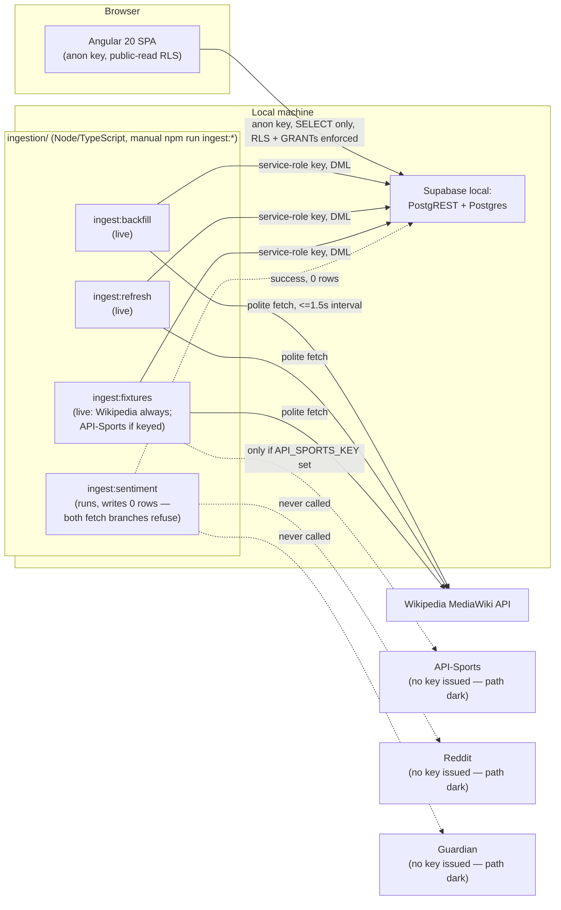
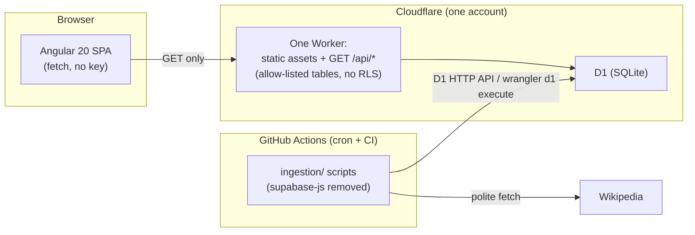

# Architecture — Springbok Tracking (as built)

> **Scope note.** This document describes `main` at commit `3f7be1b`
> ("Merge fixture detail page: pre-match game detail with H2H (#95)"), read
> on 2026-08-02 for ticket #102. It replaces the version written for #81
> (`ac4d553`), which was stale on almost every count: three ingestion
> scripts it called "print-only stubs" are now live, a schema migration and
> a whole new route (`/fixture/:id`) had landed since, and a full v2 design
> system had shipped. **Accuracy over completeness, still:** every claim
> below was checked against the source on this commit, not against a ticket
> or the PRD's intent. Where code and docs disagreed, §11 says so. Anything
> asserted about "why" cites a PRD decision ID (D-number, `docs/prd.md`) or
> an AGENTS.md rule number. A short **"decided, not yet built"** section
> (§10) exists specifically so a reader doesn't mistake an accepted plan for
> shipped code — this project has one of those right now (#94).

## 1. System summary

Springbok Tracking is, today, a local-only, read-only web app: an Angular 20
single-page app reads South Africa rugby test-match data from a local
Supabase project (Postgres + PostgREST) using the public anon key, under
Postgres row-level security that permits public reads only. A separate
family of plain TypeScript ingestion scripts, run manually via `npm run
ingest:*`, populates that Postgres database — three of the four scripts
make real network calls today (Wikipedia; optionally API-Sports), the
fourth (`sentiment`) runs for real but its two data-fetching branches
(Reddit, Guardian) both unconditionally refuse to fetch anything (§6.4) —
using the Supabase service-role key. The browser and the ingestion scripts
never talk to each other directly and never share credentials: the app has
no path to any upstream source at all (D19), and ingestion is the only
writer to Postgres.

A second diagram is included because the *current* shape above is no longer
the only one on record: on 2026-08-02 the owner decided (`docs/deployment-plan.md`
§0, ticket #94) to move the whole system to Cloudflare Workers + D1, dropping
Supabase entirely. **Nothing in that decision is built yet** — see §10. Both
diagrams are shown so a reader can tell "what runs today" from "what is
already decided to replace it" at a glance.

**Decided future shape (#94, not yet built — see §10):**

## 2. Frontend

### 2.1 Routes (`app/src/app/app.routes.ts`)

| Path | Component | State |
|---|---|---|
| `/` | `Home` | Live |
| `/history` | `History` | Live |
| `/match/:id` | `MatchDetail` | Live (post-match game detail) |
| `/fixture/:id` | `FixtureDetail` | Live (pre-match game detail, #95/D37) |
| `/match/:id/timeline` | `MatchTimeline` | Live |
| `/method` | `Method` | Live — static prose page, no data fetching |
| `**` | redirect to `/` | — |

All six routes are eagerly imported (no lazy `loadComponent`). Every
data-driven page shares one pattern: a `state` signal
(`'loading' | 'loaded' | 'error'`, with `'not_found'` added on
`MatchDetail`/`FixtureDetail`/`MatchTimeline`) drives the template, and every
Supabase call is wrapped in `try/catch` plus an explicit check of the
result's `error` field — both paths set `state` to `'error'` rather than
throwing or blanking the page (AGENTS.md non-negotiables, D16). Secondary,
independent reads (head-to-head, sentiment) are fired with `void loadX()`,
deliberately not awaited, so their failure never blocks or blanks the page's
primary content.

**Home** (`pages/home/`) — four parallel queries (`Promise.all`): upcoming
`fixtures_upstream` rows (`.gte('match_date', today)`, first row is the next
fixture); today's unfinished `matches` row (`result` is null); the latest
finished `matches` row; and the last five finished `matches` rows (for the
form guide, §4). All four `matches` queries share one column list including
every provenance sibling. Card priority: a live match today beats a next
fixture beats the off-season "no test scheduled" state (D8/D30). `today` is
computed as `new Date().toISOString().slice(0,10)` — **not** timezone-aware
the way `fixture-detail`'s SAST-based `todayInSAST` is (§11 flags this).

**History** (`pages/history/`) — one query loads **all** `matches` rows,
newest first, with the same full provenance-bearing select as Home.
Opponent/competition/era filtering and the era-by-era win-rate figure (§4)
are computed client-side over that one array — no re-query on filter
change, per D33's "no migration, no new query" scope.

**MatchDetail** (`pages/match-detail/`) — the post-match page: one match row,
its officials, its lineups, its events (four parallel queries), plus a
separately-fired (unawaited) head-to-head query keyed on the match's
`opponent_team_id`. `disagreementFor(field)` looks up any D14 "sources
differ" entry for `competition`/`springboks_score`/`opponent_score`/`venue`/
`kickoff_time` and renders `<app-sources-differ-badge>`. The score-progression
figure (§4) is only ever handed a final score when its provenance is exactly
`present` — never coerced from a non-present value.

**FixtureDetail** (`pages/fixture-detail/`) — the pre-match page added by
#95/D37. Two points the ticket specifically asks to be verified are real,
in code, today:

- **The two-read separation (D15).** Query 1 reads `fixtures_upstream`
  (`FIXTURE_DETAIL_SELECT`) filtered by date, then by opponent slug
  client-side. Query 2 — fired via `void loadHeadToHead(...)`, never
  awaited — reads `matches` for the head-to-head aggregate only. The two
  tables' rows are never merged into one query or one displayed record, the
  same discipline Home already keeps between the two tables.
- **The D14 tie-break.** `fixtures_upstream`'s real unique key is
  `(match_date, opponent_team_id, source)`, so a Wikipedia row and an
  API-Sports row can legitimately coexist for the same date/opponent. The
  component resolves that with a named constant,
  `PREFERRED_FIXTURE_SOURCE = 'api-sports'`
  (`fixture-detail.ts`): `candidates.find(r => r.source === 'api-sports')
  ?? candidates[0]` — an explicit tie-break, not an implicit "first row
  wins."

Match-day gating (`isMatchUnderWay`) is deliberately **not** just a date
comparison: it is false unless `kickoff_time` is non-null, the fixture's
`match_date` equals *today in Africa/Johannesburg* (via an injectable
`clock: () => Date`, so the behaviour is testable on any day), **and** that
clock has passed the kickoff instant. An earlier draft used date-equality
alone; Gate 2 review on #95 caught that this would have both falsely
claimed a live match for the entire calendar day and suppressed the
kickoff time itself — the fact a fan checking the page that morning came
for. No score renders anywhere on this page (the score-hero element does
not exist on this surface); lineups/officials/events instead render fixed
"not yet announced"/"not yet played" copy.

**MatchTimeline** (`pages/match-timeline/`) — match + events loaded
together; `sentiment_scores` loaded independently/unawaited. Mood-layer
state priority: no sentiment source for the era → too-few-sources (D2 floor)
→ single whole-match point (Guardian, or one Reddit thread) → full
four-bucket curve. Events always paint, regardless of the mood layer's
state (PRD §2.4).

**Method** (`pages/method/`) — the only page with no data fetching at all:
static prose explaining the sourcing rules, the two Principle-2 exceptions
(D5 derived facts = sentiment; D28 API-provided facts = fixtures), the
five-label mood vocabulary and its score bands, the D2 minimum-volume
floors, and the score-progression reconciliation gate.

### 2.2 Shared building blocks (`app/src/app/shared/`)

- **`provenance.ts`** — the single canonical `Provenance` type:
  `'present' | 'absent_in_source' | 'not_yet_fetched' | 'fetch_failed'`
  (D16).
- **`field-value/`** — the one component every provenance-bearing field
  renders through: `present` → the value; `absent_in_source` → "not
  recorded" (calm, italic); `not_yet_fetched` → a shimmering skeleton bar;
  `fetch_failed` → an alarmed "⚠ temporarily unavailable" chip. A
  `@default` arm renders the failed state defensively in case the DB CHECK
  is ever loosened without the frontend following.
- **`sources-differ-badge/`** — renders nothing given `undefined`;
  otherwise "sources differ: displayed vs alternate", each side linked
  where it has a source URL (D14).
- **`result-mark/`** — one W/L/D (or `–` for no recorded result) mark,
  reused by the form guide and the head-to-head mini-strip.
- **`head-to-head.ts`** (logic) + **`head-to-head-strip/`**
  (presentation) — `buildHeadToHead(allRows, currentMatchId)` computes the
  all-time P/W/L/D, win %, biggest win/defeat (only over rows where both
  scores are `present`, breaking margin ties by earlier date), this
  match's ordinal in the series, and the record *before* this match.
  `matchFound = false` (the route id doesn't match any real `match_id` —
  true by construction on `FixtureDetail`) means zone 3 ("the Nth
  meeting") never renders, rather than fabricating one. First-ever
  opponent renders an absent-state sentence, never `P 0 · W 0 · L 0 · D 0`.
  The strip component is shared verbatim between `MatchDetail` (post-match)
  and `FixtureDetail` (pre-match) — one component, two call sites, per
  #95.
- **`score-progression/`** + **`era-points.ts`** — see §4 (this is the
  chart-reconciliation gate).
- **`era-buckets.ts`** — `ERA_BUCKETS = ['Pre-1950','1950–1995',
  '1996–2010','2011–']` (D29's four buckets), `eraBucketOf(matchDate)`.
- **`fixture-id.ts`** — `slugifyOpponent`, `fixtureRouteId`,
  `parseFixtureRouteId` (route id = `YYYY-MM-DD-slugified-opponent`, no
  sequence suffix — see §6.2's design-doc rationale for why none is
  needed), and `todayInSAST(clock)` (Africa/Johannesburg "today", via
  `Intl.DateTimeFormat`, injectable clock for deterministic tests).
- **`match-models.ts`** — `MatchRow` (full provenance-bearing shape used
  by Home/History/Timeline) and `FixtureRow` (from `fixtures_upstream`).
  **`FixtureRow`'s doc comment is stale** as of the schema migration
  described in §5 — see §11.
- **`fixture-detail-models.ts`** — `FixtureStatus`
  (`'scheduled'|'postponed'|'tbd'|'cancelled'`), `FixtureSource`
  (`'wikipedia'|'api-sports'`), `FixtureDetailRow` (extends `FixtureRow`
  with `opponent_team_id`, `status`, `source`, `source_article_url`,
  `fetched_at`), the `FIXTURE_DETAIL_SELECT` query string, and
  `formatFetchedAtSAST`.
- **`match-detail-models.ts`** — every match-detail-shaped row type
  (officials, lineups, events, sentiment), the `EVENT_TYPE_LABELS`/
  `OFFICIAL_ROLE_LABELS`/`BUCKET_LABELS` maps, `disagreementFor`, and the
  shared select-string constants (`MATCH_DETAIL_SELECT`,
  `MATCH_EVENTS_SELECT`, `HEAD_TO_HEAD_SELECT`).
- **`team-abbrev.ts`** — `abbreviateOpponent(name)`: a fixed alias map
  (`NZL`, `BIL` for British Isles vs. `LIO` for British & Irish Lions, kept
  deliberately distinct) with a first-three-letters fallback.
- **`testing/supabase-stub.ts`** — a fluent Supabase-client stand-in for
  specs (`createSupabaseStub`, plus `createUnreachableSupabaseStub` to
  prove pages degrade to `state = 'error'` instead of throwing).

### 2.3 Data access (`app/src/app/core/supabase.service.ts`)

A thin `SupabaseService` wraps `@supabase/supabase-js`, constructed once
with `environment.supabaseUrl` (`http://127.0.0.1:54321` locally) and the
standard Supabase-CLI local-dev anon key (not a secret in itself — RLS
gates what it can read). D18/D19 hold exactly as before: no other Supabase
key is referenced anywhere under `app/`, and no user action anywhere
triggers an upstream fetch — ingestion is a wholly separate, explicitly
invoked process (§6).

### 2.4 Design system (`app/src/styles.css`)

The app is **single-theme, light-only**: `:root { color-scheme: light; }`,
no `@media (prefers-color-scheme: dark)` and no `[data-theme]` selector
anywhere in `app/src` — a deliberate decision (D32), not an oversight
(§10 of `docs/design.md` explains the print-identity rationale).

**Type.** `--font-display` and `--font-text` are the *same* Georgia-first
serif stack (`Georgia, 'Iowan Old Style', 'Palatino Linotype', …, serif`,
per D36 — an owner instruction that both headings and body copy read in
the rounder serif). Georgia ships old-style, non-tabular figures, and on
this codebase's target platform `font-variant-numeric: tabular-nums` does
not fix that (verified empirically and recorded on #92) — so a second
token, **`--font-numeric`** (the system-sans tabular stack `--font-text`
used before D36), is routed specifically to numeric-data contexts that
must line up or read as digits: the History ledger's Date/Score columns,
score heroes, kickoff times, era and head-to-head win percentages, P/W/L/D
tallies, shirt numbers, event-clock minutes, and the score-progression
chart's axis/final-score labels (applied via the `.num` utility class, a
handful of global selectors, and inline `font-family="var(--font-numeric)"`
on the score-progression SVG's text elements).

**The "masthead override."** There is no font- or theme-breaking masthead —
both the app shell's masthead and the detail-page masthead (shared by
`match-detail` and `fixture-detail`) stay on the same type tokens as
everything else; they only override background/text colour to a full-bleed
dark green band. The override that genuinely has to live in the global
stylesheet rather than a component file is a **contrast fix**:
`.detail-masthead .field-absent { color: var(--gold-300); }`
(`styles.css`). The base `.field-absent` colour is only 2.90:1 against the
masthead's dark background (fails WCAG AA); the fix can't be scoped inside
`match-detail.css` because Angular's emulated style encapsulation stamps
each component's CSS with its own `_ngcontent` attribute, and `.field-absent`
renders inside the separate `FieldValue` component's template — a
component-scoped rule would never cross that boundary. A genuinely global
rule carries no such attribute, so it's the only place this fix can live.

**Colour.** Springbok green (`--g-900`…`--g-100`) and three non-interchangeable
gold roles for brand/structure; `--paper`/`--card`/`--ink`-family for
ground and text; `--win`/`--loss`/`--draw` (plus tints) for result
semantics; `--state-absent`/`--state-loading`/`--state-failed` for the D16
honesty states (§4); `--mood-pos`/`--mood-neg`/`--mood-neutral` for
sentiment. All 59 text/non-text token pairs are WCAG 2.1 measured
(`docs/design.md` §2.2/§11): every text pair ≥4.5:1, every meaningful
non-text mark ≥3:1.

## 3. Honesty machinery, as a system

The product's whole trust argument rests on a handful of mechanisms working
together, not on any one of them. This section pulls them into one place.

**D16 provenance states.** Every nullable fact column that can legitimately
be missing carries a companion `<field>_provenance` column, one of
`present` / `absent_in_source` / `not_yet_fetched` / `fetch_failed`,
default `'not_yet_fetched'`. `FieldValue` (§2.2) is the single place these
turn into UI, and the rule that matters most: `absent_in_source` is calm
(a genuine 1891 gap is not our fault), `fetch_failed` is alarmed (this one
*is* an outage) — conflating the two tells a fan our failure is history's
fault.

**D33 aggregate captions.** The four data components added in the v2 design
pass (form guide, era-by-era record, head-to-head strip, score-progression)
are arithmetic over facts already displayed and individually sourced on the
site — not inference — so none of them wear the D5/D23 "computed" gold
stamp, which stays reserved for sentiment. Instead every aggregate carries
a mandatory plain-text caption stating its denominator and what was
excluded (e.g. "Win % of the 128 tests in this era with a recorded result;
6 further tests have no recorded result"). Rows with no recorded result are
counted into a visible "not recorded"/"unrecorded" segment and excluded
from any percentage — never guessed.

**The score-progression reconciliation gate.** `era-points.ts` holds a
hard-coded, four-row points table (try/conversion/penalty/drop-goal value
by era, 1894 onward) as an **app constant**, deliberately not a database
column — `match_events.points_value` was considered and excluded, because
the app-constant table is self-checking: `computeProgression` renders the
chart only if every scoring event in the match is timed **and** the
reconstructed running total reconciles exactly to the match's stored final
score; any mismatch, any untimed event, a match before 1894 (points values
moved three times 1890–1894 and cannot be pinned per fixture), or a missing
final score all fail the gate and the chart doesn't render — the page says
why instead (`progressionFailureCopy`). A `points_value` column would
remove that self-checking property (a wrong stored value would just be
believed).

**No score, pre-match.** `FixtureDetail` (§2.1) has no score-hero markup at
all — not a placeholder dash, not `0–0`. This is mechanically checkable
(no `.score`/`.score-hero` element exists on that page).

**Match-day gating.** Both `Home`'s live-match card and `FixtureDetail`'s
under-way state require the kickoff instant to have actually passed, not
merely the calendar date to match (§2.1) — the distinction between "today"
and "kickoff has happened" is what stops the page from claiming a match is
live for an entire day before it starts.

## 4. Database (`supabase/migrations/`, `supabase/seed.sql`)

Three append-only migrations exist:
`20260801105708_initial_schema.sql` (the schema),
`20260801113000_service_role_grants.sql` (the #80 fix, described below),
and `20260801140000_fixtures_upstream_status_and_source.sql` (#79's
`status`/`source`/`source_article_url` additions to `fixtures_upstream`,
described in §4.1). Provenance is `text` + `CHECK` rather than an enum
throughout (enums churn badly; AGENTS.md 1.3), and migrations from here on
are append-only — schema changes are new files, never edits to an applied
one.

### 4.1 Tables

| Table | One-line purpose | Key columns |
|---|---|---|
| `teams` | Canonical team names + aliases; the cross-source join key (D13) | `id`, `canonical_name` (unique), `aliases text[]` |
| `matches` | One row per test match (D12's match set) | `match_id` (text PK, D13 identity: date+opponent+sequence), `match_date`, `opponent_team_id`, `sequence`, `competition`/`venue`/`kickoff_time`/`springboks_score`/`opponent_score` each with a `<field>_provenance` sibling (D16), `home_away`, `result`, `source_article_url`; unique `(match_date, opponent_team_id, sequence)`; index on `match_date desc` |
| `match_officials` | Referee + other named officials, display strings only (D13) | `match_id` FK, `role` (`referee`/`assistant_referee`/`tmo`/`other`), `name` + `name_provenance` |
| `match_lineups` | Both starting XVs where present; each name independently provenance-tagged | `match_id` FK, `team_side`, `shirt_number`, `player_name` + `player_name_provenance` |
| `match_events` | One dataset shared by game-detail (list) and timeline (plotted view) per D7 | `match_id` FK, `sequence_no`, `event_type`, `team_side`, `description`/`minute` each with provenance; unique `(match_id, sequence_no)` |
| `fixtures_upstream` | Future fixtures, from Wikipedia season articles and (dormant) API-Sports, licence-separated from played-match tables (D15) | `api_sports_fixture_id` (unique), `match_date`, `opponent_team_id`, `kickoff_time`, `venue`, `competition`, `fetched_at`; **since migration 3:** `status` (`scheduled`/`postponed`/`tbd`/`cancelled`, not null default `scheduled`), `source` (`wikipedia`/`api-sports`, not null default `wikipedia`), `source_article_url`; unique `(match_date, opponent_team_id, source)`. No D16 `<field>_provenance` columns — see §11 for a doc/code mismatch on this exact point. |
| `sentiment_scores` | Derived facts (D5/D23) — score/label/URL/dates only, never source content (D20) | `match_id` FK, `bucket` (`pre_match`/`first_half`/`second_half`/`post_match`/`whole_match`), `score numeric(4,3)` in [-1,1], `label` (5-value D2 vocabulary), `bucket_source_count`, `too_few`, `source` (`reddit`/`guardian`), `source_url`; unique `(match_id, bucket, source)`. Currently zero live rows — no script writes to this table yet (§6.4). |
| `source_snapshots` | Raw wikitext per source page, so parses are reproducible/diffable (D17). Not displayed publicly. | `source_page`, `match_id` (nullable FK, `on delete set null`), `wikitext`, `fetched_at` |
| `ingestion_runs` | Ops guardrail row per run (D25). Not displayed publicly. | `source`, `pages_fetched`, `rows_written`, `failures`, `status` (`running`/`success`/`failed`), `notes` |

Every FK to `matches` cascades on delete except `source_snapshots`, which
sets `match_id` to null instead. `supabase/seed.sql` seeds 3 real,
documented matches (1995 and 2007 Rugby World Cup finals, 2015
semi-final) for the walking-skeleton proof (#73), independent of and
predating the real ~570-match Wikipedia backfill (§6).

### 4.2 `fixtures_upstream`'s status/source columns (#79)

The third migration adds `status`, `source` and `source_article_url` where
none existed before. `status` (`scheduled`/`postponed`/`tbd`/`cancelled`)
lets a postponed or TBD-venue fixture render distinctly instead of
collapsing into one indistinguishable chip. `source` plus a new unique
constraint `(match_date, opponent_team_id, source)` — replacing sole
reliance on `api_sports_fixture_id unique` — let a Wikipedia-sourced row
and an API-Sports-sourced row for the same fixture coexist without
duplicate inserts on repeated `ingest:fixtures` runs, which is exactly the
multiplicity `fixture-detail.ts`'s tie-break (§2.1) resolves. This is
consumed on both sides today: `ingestion/src/scripts/fixtures.ts` writes
all three columns, and `pages/fixture-detail/` reads all three; **`pages/home/`
does not yet read them** (§11).

### 4.3 RLS and grants posture

- RLS is enabled on all nine tables.
- `anon` gets an explicit `for select using (true)` policy **and** an
  explicit `GRANT SELECT` on seven display tables (`teams`, `matches`,
  `match_officials`, `match_lineups`, `match_events`, `fixtures_upstream`,
  `sentiment_scores`) — both are required because recent Supabase CLI
  versions stopped auto-exposing new tables to PostgREST API roles.
- `source_snapshots` and `ingestion_runs` get **no** policy and **no**
  grant to `anon` — RLS's default-deny leaves both completely unreadable
  (and unwritable) to the public role.
- No anon **write** policy exists anywhere — writes only ever happen via
  the service-role key, used exclusively by the ingestion scripts
  (D18/D19).
- **The #80 story:** the initial migration granted `anon` `SELECT` but
  never granted `service_role` anything — `service_role`'s
  `rolbypassrls` bypasses RLS checks, but a missing `GRANT` is a separate
  gate that bypass does not clear, so every real ingestion write failed
  with "permission denied" until the second migration explicitly granted
  `service_role` `SELECT, INSERT, UPDATE, DELETE` on all tables (present
  and future, via `ALTER DEFAULT PRIVILEGES`) plus `USAGE, SELECT` on
  sequences. Landed as its own migration, per the append-only convention.

**This posture is exactly what #94's Cloudflare direction discards** — D1
has no roles, grants or row-level security at all, so if that migration
ships, this whole subsection is replaced by Worker-code checks. See §10.

## 5. Ingestion (`ingestion/src/`)

Plain TypeScript, run via `tsx`/`npm run ingest:*`, tested with `vitest`
directly (no framework — AGENTS.md 1.3, PRD D21). Every real script loads
`ingestion/.env` (gitignored) via `lib/env.ts`'s hand-rolled loader before
doing anything else, then gets a `SupabaseClient` from
`lib/supabase-client.ts` using `SUPABASE_URL` + `SUPABASE_SERVICE_ROLE_KEY`
— the service-role key never appears in the Angular bundle and is read
only from that gitignored file (D18).

### 5.1 Pipeline status, as of this commit

All four scripts are live code today — the "stub" characterisation in the
#81-era document is stale.

| Script | Status | What it does |
|---|---|---|
| `ingest:backfill` | **Live** | Fetches the Wikipedia list article's wikitext once, snapshots it (D17), parses all 570 match templates (`lib/wiki-list-parser.ts` + `lib/match-normaliser.ts`), upserts `teams` + `matches` + referee `match_officials` rows, evaluates the D25 guardrail, writes an `ingestion_runs` row. |
| `ingest:refresh` | **Live** (#76) | For matches already in `matches` (1994 onward — earlier years' source pages don't carry this shape), tries a small deterministic list of Wikipedia article-title guesses, parses each match's `{{Rugbybox}}` block (`lib/rugbybox-parser.ts`) for lineups, additional officials, and minute-stamped scoring/card events, writes `match_lineups`/`match_officials`/`match_events`, evaluates D25. |
| `ingest:fixtures` | **Live** (#79) | Always fetches Wikipedia season/tour articles via a small title ladder (`lib/wiki-season-discovery.ts`) and parses upcoming (unplayed) fixtures (`lib/wiki-fixtures-parser.ts`); additionally calls the real, unit-tested API-Sports client **only if `API_SPORTS_KEY` is set** (it isn't, in any environment today — see §5.2). Upserts `fixtures_upstream` with `status`/`source`/`source_article_url`; API-Sports rows win D14's precedence over a Wikipedia row for the same date/opponent, and the Wikipedia row is dropped rather than double-written. |
| `ingest:sentiment` | **Live but architecturally refusing** (#78) | Runs for real and writes a real `ingestion_runs` row, but both its Reddit and Guardian branches unconditionally decline to fetch anything regardless of whether their API keys are configured — see §5.4. Zero rows ever written to `sentiment_scores` by this script today. |

Because only `backfill`/`refresh`/`fixtures` currently write real rows, and
`sentiment` writes none, `sentiment_scores` has zero live rows on this
commit even though its schema, its writer functions, and its retention
tests are all real, tested code.

### 5.2 API-Sports client — wired in, not dormant, just unkeyed

A common misreading worth correcting explicitly: `lib/api-sports-client.ts`
is not dead code sitting unused. `ingestion/src/scripts/fixtures.ts`
imports and calls `isApiSportsConfigured()`/`fetchUpcomingFixtures()`
directly, and takes that branch whenever `API_SPORTS_KEY` is set. It is
unit-tested against a recorded fixture (`api-sports-client.spec.ts`). The
reason it has never made a live call is purely that no key has ever been
issued (#67's client action never completed) — the code path is real and
reachable, just never yet exercised outside tests. **This is also the
piece #94's deployment plan proposes to retire permanently** — see §10's
note on draft D39.

### 5.3 Politeness and budget (D24, AGENTS.md 1.4)

`lib/wikipedia-client.ts` enforces a serial `MIN_INTERVAL_MS = 1500`
between fetches (raised from an original 1000ms after a live stratified
`ingest:refresh` run hit real HTTP 429s even at ≤1rps — a burst limit
distinct from the steady-state figure), with up to two backoff retries
(5s, then 15s, respecting a `Retry-After` header) before surfacing a
`WikipediaFetchError`. Every fetch sends the honest User-Agent
`springbok-tracking (github.com/MichaelJShepherd/springbok-tracking)`.
**This throttle exists only on the Wikipedia client** — the API-Sports,
Reddit and Guardian clients each make a single unthrottled `fetch()`,
gated only by their `is*Configured()` boolean, not by any rate limiter.
That has no live consequence today (no key exists for any of the three),
but it is a gap to close before any of them is switched on for real.

### 5.4 `ingest:sentiment` — refusal branches and D20 retention (#78, #88)

Both live branches refuse unconditionally:

- **Reddit**, even with `REDDIT_CLIENT_ID`/`REDDIT_CLIENT_SECRET` set:
  there is no real match → Reddit-thread-id lookup in the codebase yet,
  and inventing one would fire a live OAuth request against a garbage
  thread id. The script logs the refusal and calls
  `fetchMatchThreadComments()` from no code path.
- **Guardian**, even with `GUARDIAN_API_KEY` set: there is no real query
  builder (opponent name + match-date window) to construct a search, so
  `fetchMatchArticles()` is likewise never called.

The script never calls `evaluateGuardrail` at all (D25's guardrail is
**absent** here, not adapted — an earlier draft of this project's own docs
claimed otherwise and was wrong) — there is nothing meaningful for a
zero-rows check to evaluate while zero rows is the only reachable outcome.
It always writes a clean `success` / `rows_written: 0` `ingestion_runs`
row instead, with a `notes` reason of `source_configured_but_live_path_not_implemented`
or `no_source_configured`.

**D20 retention is real production code, not test-only.**
`lib/sentiment-pipeline.ts`'s row-building functions return a type
structurally limited to the eight D20-permitted columns (`match_id`,
`bucket`, `score`, `label`, `bucket_source_count`, `too_few`, `source`,
`source_url`) — no field can hold raw comment/article text, regardless of
tests. `lib/sentiment-retention.spec.ts` is the automated proof, combining
four independent techniques: (a) running the real row-builders against
fixture text containing a unique marker, with all `console.*` spied, and
asserting the marker never appears in a row or a log call; (b) asserting
the returned object's keys are *exactly* the permitted eight; (c) a
static, paren-depth-aware source scanner run glob-wide over every
non-spec file under `src/lib` and `src/scripts` (not a fixed file list),
flagging any logging call referencing `.body`/`.headline`/`.standfirst` or
stringifying a comments/articles collection; and (d) an upsert-site guard
confirming `sentiment.ts` has no `sentiment_scores` write path at all
today. The lexicon itself (`lib/sentiment-lexicon.ts`) is a small,
hand-written word list — deliberately not the real AFINN dataset, to keep
this public repo clear of a third-party dataset's own licence terms
(AGENTS.md 1.1).

**#88** is the follow-up task that would make this pipeline real: a real
match→thread lookup, a real Guardian query builder, D4's per-match source
ladder, the D25 guardrail restored around whatever that live path writes,
and the D2 accuracy spot-check (≥8/10 matches directionally correct)
recorded once. Nothing above is missing by accident; it's explicitly the
next slice.

### 5.5 Team directory, snapshots

`lib/team-directory.ts` maps every rugby-code/IOC-code token the source
articles use (including duplicate codes for the same country) to one
canonical name plus aliases (D13); an unrecognised code resolves to
`undefined` and callers must treat that as unresolved, never invent a
name. `source_snapshots` stores each source page's full raw wikitext
before any parsing-dependent write happens (backfill: before the `teams`/
`matches` writes; refresh/fixtures: before that page's blocks are matched
against a target) — the receipt that makes re-parses reproducible and a
future Wikipedia restructure diffable.

## 6. Compliance invariants

> The following must hold today and be re-checked at every change:

- **D18** — no Supabase key beyond the anon key ships in the Angular
  bundle; the service-role key exists only in `ingestion/.env` (gitignored).
- **D19** — no user-triggered request ever reaches an upstream source;
  ingestion is exclusively an explicitly-invoked local process.
- **D20** — source content (Guardian article/headline text, Reddit comment
  bodies) must never be persisted, only derived scores + URLs/timestamps.
  Enforced today by real production code and a real automated scanner
  (§5.4), even though the live fetch paths that would produce real rows
  are still refusing to run (#88). D20 itself records that the whole
  retention model must be revisited before any real deployment — the #94
  deployment plan's draft D40 is exactly that revisit (§10).
- **D14 "sources differ"** — where two *display-cleared* sources disagree,
  both are stored, the precedent value displays, and a badge links both —
  never a silent pick. Exercised today in `MatchDetail`'s
  `disagreementFor` and, as a same-table tie-break rather than a
  disagreement badge, in `FixtureDetail`'s source preference (§2.1).
- **D15 licence separation** — Wikipedia-derived data (CC BY-SA, attributed
  per D26) and API-Sports-derived fixture rows never mix into one exported
  or displayed record; the site offers no bulk download today.
- **AGENTS.md 1.4** — scraping/data-collection must never breach a site's
  terms of service; access must be polite and never circumvent technical
  access controls. The only live external fetch today is Wikipedia's
  MediaWiki API, serially at ≤1 fetch per 1.5s with an honest User-Agent
  (§5.3), under the ambiguous-terms "proceed at owner's risk" posture the
  owner accepted for this non-commercial project (task #64) — void the
  moment the project becomes commercial, and explicitly flagged in the #94
  deployment plan as needing re-confirmation at first real deploy.

## 7. Testing shape

Both test suites run entirely offline (D27): recorded wikitext samples
from each era, and canned API-Sports/Reddit/Guardian JSON, live in the
repo as fixtures (`ingestion/src/lib/__fixtures__/`); no test ever calls a
live API. `app/src/app`: 13 spec files, **124** `it`/`test` cases (page
specs for all six routes plus unit specs for `era-points`, `fixture-id`,
`head-to-head`/`head-to-head-strip`, `match-models`, `team-abbrev`).
`ingestion/src`: 16 spec files (all under `lib/`), **175** `it`/`test`
cases, covering every parser (golden-file, per-era regression),
the D25 guardrail, and the D20 retention scanner described in §5.4. Parser
regressions are era-stratified per D27; sentiment gets unit tests on the
lexicon scorer and volume floor rather than a live-data spot-check, since
no live data flows yet.

Beyond the counts, the culture worth naming: AGENTS.md's Gate 3 (a
separate reviewer asking "would this test fail if the functionality it
covers actually broke?") is why the retention scanner above exists in its
current four-technique form rather than a single naive check — an earlier,
weaker version was caught and hardened by exactly that review, and the
spec file's own test names (`Gate 3 bypass #1/#2/#3`, `Gate 3 hardening
#1/#2`) record that history rather than hiding it.

## 8. Local-only scaffolding vs. deployment-deferred (#66)

Per PRD D22, "production" for this run of the project has meant `ng build`
output served locally against a local Supabase instance. As of this
commit, that is still literally true — but D22 itself is the row #94's
deployment plan explicitly supersedes (draft D37, §10). What's still
absent today, unrelated to #94:

- Supabase Edge Functions (D21 allows them "where needed"; nothing uses
  one — ingestion is plain Node scripts).
- SSR (D21 rules it out for v1 entirely).
- Any bulk/redistributable data export (D15's separate-table containment
  is still the whole answer; deployment-plan draft D38 would allow a
  Wikipedia-only export in principle, but nothing exports today).

## 9. Cross-decision map (D14–D37, one line each)

The full rationale for each row lives in `docs/prd.md`'s decision-log
table; this is a lookup, not a duplicate.

| Decision | One line |
|---|---|
| D14 | Source precedence per field class; Wikipedia sole displayed source for played matches, API-Sports > Wikipedia for fixtures; disagreements between display-cleared sources badge, never silently pick. |
| D15 | Wikipedia-derived and API-Sports-derived data live in separate tables, never mixed into an export; no bulk download in v1. |
| D16 | Four-state provenance model on every nullable fact column. |
| D17 | One-off backfill via ingestion scripts; raw wikitext snapshotted per source page. |
| D18 | All upstream calls server-side; no key beyond anon ever reaches the browser. |
| D19 | No user request ever triggers an upstream fetch. |
| D20 | Source content lives only in ingestion-process memory; only derived scores/URLs/dates persist. Must be revisited before real deployment (#71). |
| D21 | Stack: Angular 20 SPA + Supabase (as of this commit); plain Node ingestion; no SSR. |
| D22 | Local-only build is "production" for this run; deployment explicitly deferred. |
| D23 | Derived-mood badge copy: "computed by this site from X", never phrased as the source's own view. |
| D24 | Fetch-budget arithmetic; all paths within free-tier headroom. |
| D25 | Every ingestion run writes a status row; zero-rows or >20pt completeness drop fails loudly. |
| D26 | Per-page (or per-fact, per #95) Wikipedia attribution + CC BY-SA + "modified" clause. |
| D27 | Tests run entirely on recorded fixtures; no live API calls in any test. |
| D28 | API-provided facts (fixtures) get a provenance-note "viewable source" instead of a per-record page. |
| D29 | Coverage measurement definitions and era buckets. |
| D30 | Off-season card drops the unsourced "next likely window" note. |
| D31 | Home gets the same site-level attribution footer as History, plus its own `/method` link. |
| D32 | Design v2: "heritage rugby / record book," warm paper, green/gold, single light theme. |
| D33 | Derived aggregates (form guide, era record, head-to-head, score progression) get a count caption, not the D5 computed stamp. |
| D34 | The four v2 data components' inventory and scope (streaks/rolling-form/player-pages explicitly excluded). |
| D35 | Bundle-size warning raised to 600kB; `@supabase/supabase-js` named as the real weight driver, revisit at deployment. |
| D36 | Georgia-first serif for display and body; `--font-numeric` token introduced for numeral contexts. |
| D37 | New `/fixture/:id` pre-match page; the D14 tie-break and D15 two-table separation described in §2.1. |

## 10. Decided, not yet built

Three pieces of this project are **owner-decided but not present in the
code on this commit.** Full detail lives in the linked documents; this
section exists so a reader doesn't mistake a decision for a deployment.

**#94 — the Cloudflare Workers + D1 direction.** On 2026-08-02 the owner
read `docs/deployment-plan.md` and made four calls (its §0): architecture
= Cloudflare Workers + D1 (not the plan's own static-first recommendation);
**no Supabase anywhere**, including for ingestion; Cloudflare Pages
accepted; and both licence questions closed (Wikipedia-derived data may be
published in principle, draft D38; API-Sports is dropped permanently,
draft D39). The plan's own words: *"Nothing here is implemented and no
application code changes with this document."* §4A lays out five
implementation phases (D1 schema port; a five-endpoint read-only Worker
API; an ingestion write-layer refactor removing `supabase-js` entirely;
the app's data-layer swap from `supabase-js` to `fetch`; Pages + CI +
cron), an estimated 7–8 engineering-days total, none started. Draft
decision rows **D37–D44** (deployment-plan.md §9) restate and extend the
PRD's own decision log for this move but are deliberately **not yet
written into `docs/prd.md`** — the implementation ticket lands them, to
avoid two in-flight branches editing the same table. **Numbering caveat:**
the plan's drafts were written before #95 landed, and the PRD's real D37
is now taken by the `/fixture/:id` decision — the deployment drafts must
be renumbered (D38+) when they land. (The phase tickets exist on the
project board as #97–#101, one per Phase A–E; those numbers appear only
on the board, not in this repository's files.) The
consequence called out most clearly for this document specifically:
§0 states plainly that Postgres RLS goes away under this plan, "and with
it the property that public read-only access is enforced by the database
rather than by code we wrote (`docs/architecture.md` §3.3)" — i.e. §4.3
above is the section that gets rewritten, to Worker-code checks, if and
when this lands.

**#88 — sentiment live paths.** D2/D4's Reddit-primary/Guardian-fallback
ladder is fully decided and its retention rules (D20) are fully enforced
in code (§5.4), but the actual fetch paths are wired to unconditionally
refuse. #88 is the task that would add the real match→thread lookup, the
real Guardian query builder, the restored D25 guardrail, and the D2
accuracy spot-check. The #94 deployment plan additionally gates the
sentiment cron on #88 landing first (its own draft D41).

**#67 — Reddit/Guardian keys.** A client action, not a code task: no
Reddit OAuth registration and no Guardian Open Platform key exist yet.
Its API-Sports half is closed permanently by #94's draft D39; its Reddit
half remains open, gated behind #88.

## 11. Code-vs-docs disagreements found while verifying this document

Recorded here because the ticket asked for them, and because leaving them
unrecorded would mean the next person re-discovers them from scratch:

1. **`app/src/app/shared/match-models.ts`'s `FixtureRow` doc comment is
   stale.** It still says "this table carries no provenance columns," and
   `pages/home/home.ts` has a matching comment claiming `fixtures_upstream`
   "carries no status column, so there is no data to distinguish
   'postponed' from 'not yet confirmed.'" Both were true before migration
   `20260801140000_fixtures_upstream_status_and_source.sql` (#79) landed
   and are false now — the table has carried `status`/`source`/
   `source_article_url` since then, and `pages/fixture-detail/` already
   reads all three. **Home's own query and its fixture-chip logic have not
   been updated to use the real `status` value** — this is a real, live
   inconsistency between two pages that render the same table, not just a
   stale comment, and is worth a follow-up ticket.
2. **`Home.todayIso()` is not timezone-aware; `FixtureDetail`'s
   `todayInSAST()` is.** Home computes "today" as
   `new Date().toISOString().slice(0,10)` (UTC-based), while the newer
   fixture-detail page deliberately computes "today in
   Africa/Johannesburg" so a fan on a UTC-behind or -ahead device sees the
   same day South Africa does (a bug #95's own Gate 2 review caught and
   fixed on that page). Home's off-season/live-match date comparisons
   inherit the older, non-SAST-aware behaviour and were not revisited when
   the SAST-aware helper was introduced.
3. **An earlier version of this project's own documentation
   (`docs/field-map.md`) once suggested `ingest:sentiment`'s D25 guardrail
   check still "applies once configured."** That line was itself wrong and
   has since been corrected in that file: the guardrail is not called at
   all while both fetch branches are hard-refusing, not adapted per
   configuration. This document (§5.4) states the corrected version.
4. **The #81-era `docs/architecture.md`** (this document's predecessor)
   described `ingest:refresh`, `ingest:fixtures`, and `ingest:sentiment` as
   "stubs" that "print the plan and exit 0." All three now make real
   network and/or database calls (§5.1); only `sentiment`'s two
   data-fetching branches still refuse to fetch, and even that refusal is
   itself live logic (a logged, deliberate decision per run), not a
   `printStubPlan()` no-op. `lib/ingestion-run.ts`'s old `printStubPlan`/
   `StubPlan` helper still exists in the codebase but is dead code — no
   script calls it any more (only that file's `USER_AGENT` constant is
   still imported).

Nothing else surfaced a disagreement worth flagging: the route table, the
shared-component inventory, the schema (including the #79 migration), the
design-system facts, and the PRD decision log were all found to match the
code on this commit.
